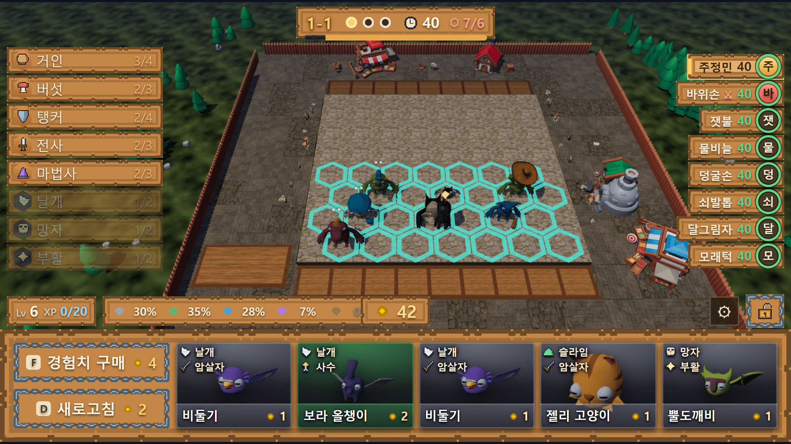
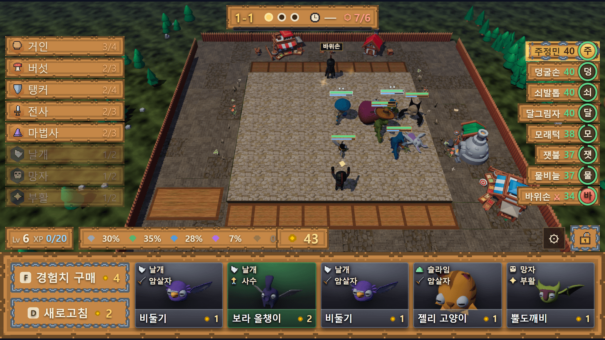
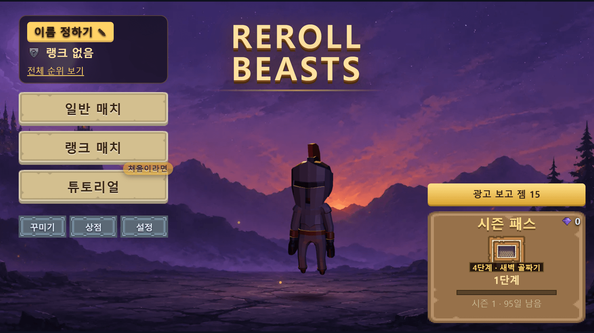

# Reroll Beasts · 리롤 비스트

**브라우저에서 도는 8인 실시간 오토체스.** 몬스터 26종, 육각 판 4×7, 23라운드.
프레임워크 없이 바닐라 JS + three.js 로 만들고, 전용 게임 서버가 판정을 쥔다.

▶ **플레이**: [verse8.io/z4a6Q8X](https://verse8.io/z4a6Q8X) (모바일 가로 / PC 브라우저)

```
JavaScript (ESM) · three.js · Vite · TypeScript 게임 서버 · 780개 테스트 · 5개 언어
```


*배치 30초. 왼쪽은 시너지, 오른쪽은 여덟 명의 체력, 아래는 상점. 육각 칸에 어디를 세우느냐가 전투의 전부다.*

| 전투 | 홈 |
|---|---|
|  |  |
| 판정은 서버가 내리고 화면은 로그를 재생한다. 오른쪽 체력이 실시간으로 갈린다 | 매치·랭크·튜토리얼, 시즌 패스와 아바타 |

---

## 어떤 게임인가

여덟 명이 같은 방에 들어가 매 라운드 상점에서 유닛을 사고, 육각 판에 배치하고,
서로 한 명씩 붙는다. 진 쪽이 체력을 잃고 0이 되면 탈락한다. 마지막 한 명이 1등이다.

- **30초 배치 → 자동 전투**. 전투에는 조작이 없다. 배치와 경제가 전부다.
- **8인 동시 진행**. 남의 판을 실시간으로 훔쳐볼 수 있고, 내 판에 구경 온 사람의
  아바타가 보인다. 탈락해도 남의 전투를 관전한다.
- **상성**: 계통 5종 × 직업 6종, 같은 계통·직업을 모으면 시너지가 열린다.
- 시즌 패스, 랭크(LP), 업적, 상점 재화 — 라이브 서비스 구조를 한 벌 갖췄다.

---

## 이 프로젝트에서 봐야 할 것

### 1. 전투는 순수 함수다 — 렌더러가 아니라 로그를 만든다

`sim/combat.js` 는 three.js 도 DOM 도 모른다. 판 두 개와 시드를 받아 **전투 로그**를
뱉는다. `game/src/battle.js` 는 그 로그를 재생만 한다.

```
simulate({ boardA, boardB, seed, data })  →  [{ tick, type, ... }, ...]
                                              │
                    ┌─────────────────────────┼──────────────────────────┐
                    ▼                         ▼                          ▼
            클라이언트 재생            서버 판정(같은 코드)        헤드리스 밸런스 시뮬
          game/src/battle.js         server/src/server.ts          sim/run.mjs
```

덕분에:

- **서버가 클라이언트를 믿지 않아도 된다.** 같은 시드로 같은 결과가 나오므로
  서버가 직접 돌려 체력·등수·LP 를 박는다.
- **밸런스를 수만 판 돌려서 잰다.** 화면 없이 `sim/run.mjs` 로 승률을 뽑는다.
  직업별 승률이 37~50% 로 갈리는 것을 이 러너로 찾았다.
- **전투 테스트가 빠르고 결정론이다.** 골든 로그를 저장해 두고 회귀를 잡는다.

### 2. 규칙은 코드가 아니라 데이터다

유닛·아이템·경제·라운드·상점·패스 전부 `game/public/data/*.json` 한 벌이 단일 소스다.
클라이언트가 런타임에 `fetch` 로 읽으므로 **JSON 만 고쳐서 재배포**할 수 있다.

`tools/validate.mjs` 가 데이터의 불변식을 지킨다 — 스킬 파라미터가 스킬 종류와 맞는지,
직업 키가 실재하는지, 패스 무료 보상이 1레벨에 걸리지 않는지 같은 것들. 테스트에서도
이 불변식을 같이 돌린다.

### 3. 서버가 권위를 쥔다

`@agent8/gameserver-node` 위에 올린 TypeScript 서버가 방 상태를 들고 있다.

- 배치 마감, 전투 판정, 체력, 탈락 등수, 랭크 점수를 **서버가 정한다.**
- 클라이언트가 올린 판은 서버에서 한 번 걸러진다(없는 유닛 id 하나가 방 전체를
  멈추게 한 적이 있다).
- 같은 라운드를 두 번 판정하지 않도록 방 단위 락을 건다.

### 4. 직접 잡은 문제들

포트폴리오로서 이 저장소의 값은 여기 있다. 커밋 메시지에 원인과 근거를 남겼다.

| 증상 | 진짜 원인 |
|---|---|
| 사람마다 상대 체력이 다르게 보였다 | 전투 연출이 먼저 끝난 사람이 서버 판정을 부르고, 아직 연출 중인 사람은 이미 깎인 체력을 한 번 더 깎았다. 서버가 판정한 라운드는 클라이언트가 체력을 손대지 않게 했다 |
| 같은 라운드인데 화면마다 다른 전투가 나왔다 | 상대의 마지막 배치가 마감 직전에 올라와 각자 낡은 판으로 돌렸다. 전투 전에 서버 판정(판 포함)을 받아 그 판으로 재생한다 |
| 봇 방에서 등수가 영영 안 박혔다 | 서버에는 타이머가 없다. 마감은 누군가 호출할 때만 돈다 — 내가 죽으면 부를 사람이 없었다 |
| PC 에서만 닉네임 저장이 안 됐다 | 입력칸 포커스가 빠지며 창이 움직여, 누르는 사이에 단추가 자리를 떠 click 이 생기지 않았다 |
| 2성 이상 유닛에 장비를 끼면 별이 늘어졌다 | WebGL2 `texStorage2D` 저장소는 불변이라, 캔버스 크기가 바뀌면 텍스처를 새로 만들어야 한다 |
| 모바일에서 판 밖 풀바닥이 사라졌다 | 정적 메시 병합이 병합 대상이 아닌 지오메트리까지 정리했다 |

### 5. 손으로 만든 렌더링 최적화

모바일 브라우저가 목표라 프레임 예산이 빡빡하다.

- 움직이지 않는 지형·나무·바위는 **한 덩어리로 병합**해서 드로우콜을 줄인다.
- 별·아이템 뱃지·이름표는 캔버스에 그려 텍스처로 붙인다.
- 화면이 숨으면 rAF 가 멈춘다는 전제로 시계를 짰다(절대 시각으로 따라잡는다).
- 세로 화면, 소프트 키보드, `visualViewport`, 롱프레스 메뉴까지 모바일 실기 기준으로 맞췄다.

---

## 구조

```
sim/          게임 규칙 전부. 순수 함수. DOM·three.js 의존 없음
              combat  targeting  movement  skills  traits  stats  economy
              lobbyRound  rank  pass  missions  season  store …
game/
  src/        렌더링과 화면. sim 의 결과를 보여주기만 한다
              battle(전투 재생)  prep(배치)  scene3d  avatarView  home  result …
  public/
    data/     규칙 데이터 단일 소스 (JSON 14개)
    assets/   스프라이트·모델·사운드 (전량 CC0, CREDITS.md 참조)
server/src/   TypeScript 게임 서버. 방·판정·랭크·상점 검증
tools/        데이터 불변식 검사, 에셋 파이프라인, 밸런스 러너
tests/        780개 (vitest). 골든 로그 회귀 포함
docs/         설계 문서 8편 — 만들기 전에 쓴 스펙
```

코드 약 **16,000줄** (sim + game/src + server, 에셋·의존성 제외).

## 실행

```bash
npm install
npm run dev      # 개발 서버 (http://localhost:5180)
npm run check    # 데이터 불변식 + 테스트 780개
npm run build    # dist/ 로 빌드
```

에셋 반입(`npm run art`)은 원본 팩이 있어야 돈다. 저장소에는 가공 결과만 들어 있다.

## 만든 방식

설계 문서를 먼저 쓰고(`docs/superpowers/specs/`), 테스트로 고정한 뒤 구현했다.
버그는 증상이 아니라 원인을 찾을 때까지 파고, 고친 뒤에는 **고친 코드를 일부러
되돌려 테스트가 실제로 깨지는지** 확인했다. 커밋 메시지는 "무엇을 바꿨나"가 아니라
"왜 그랬나"를 적었다.

---

## English summary

**Reroll Beasts** is a browser-based 8-player real-time auto battler — 26 units, a 4×7
hex board, 23 rounds. Built with vanilla JS (ESM) and three.js, no UI framework, with a
TypeScript authoritative game server.

Highlights:

- **Deterministic simulation core** (`sim/`) with zero rendering dependencies. It emits a
  combat log; the client replays it, the server re-runs it to judge, and a headless runner
  replays thousands of matches for balance tuning — one codebase, three consumers.
- **Server authority** over HP, eliminations, ranking and rank points, with room-level
  locking so a round is never judged twice.
- **Data-driven rules**: all balance lives in JSON, fetched at runtime and guarded by an
  invariant checker.
- **780 tests** including golden combat logs; every bug fix is verified by mutating the fix
  and watching the test fail.
- Mobile-first rendering work: static mesh merging, canvas-baked overlays, soft-keyboard
  and viewport handling.

Play it at [verse8.io/z4a6Q8X](https://verse8.io/z4a6Q8X).

---

에셋은 전량 CC0 이며 출처는 [CREDITS.md](CREDITS.md) 에 있다.
